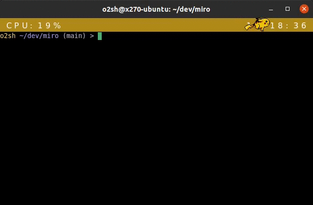
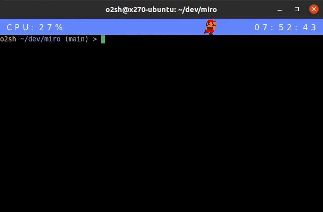
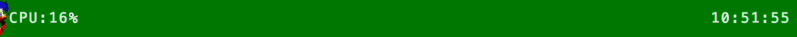

# Miro

A GPU-accelerated terminal emulator written in Rust.

|miro -t pika|miro -t kirby|
-|-
|||
|miro -t mario|miro -t sonic|
|||
## Building from source

First, install the [Rust toolchain](https://www.rust-lang.org/tools/install) and then

```sh
git clone https://github.com/o2sh/miro
cd miro
cargo run
```

Make sure to have the following libraries installed on your machine:

- Ubuntu

```sh
sudo apt-get install -y libxcb-icccm4-dev libxcb-ewmh-dev libxcb-keysyms1-dev \
libfontconfig1-dev libfreetype6-dev libegl1-mesa-dev
```

- Arch Linux

```sh
sudo pacman -S libxcb xcb-util-keysyms xcb-util-wm mesa freetype2 fontconfig
```
