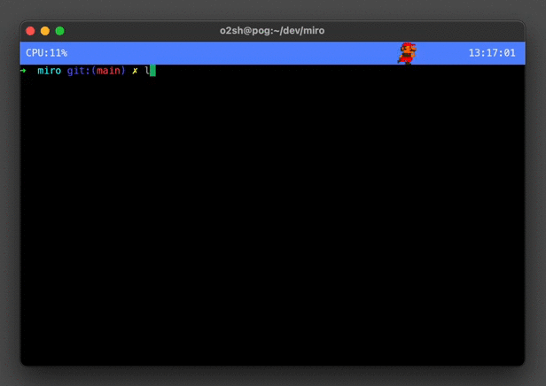

# Miro

A GPU-accelerated terminal emulator written in Rust.

<h3 align="center"></h3>

## Themes

`miro -t pika|kirby|sonic`


## Installation

```text
git clone https://github.com/o2sh/miro --depth=1
cd miro 
make install
miro
```

## Status

- [x] Mac OS support with Cocoa and OpenGL.
- [x] Linux support with XCB and OpenGL.
